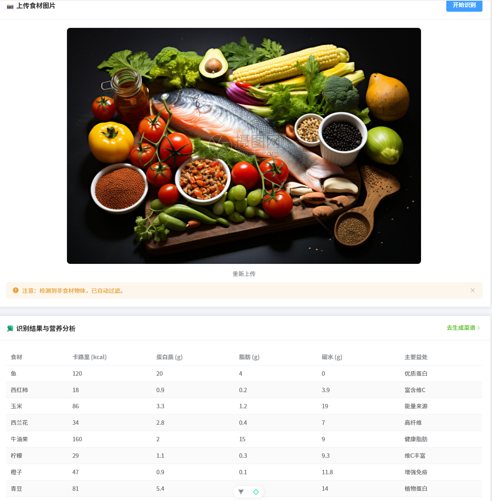
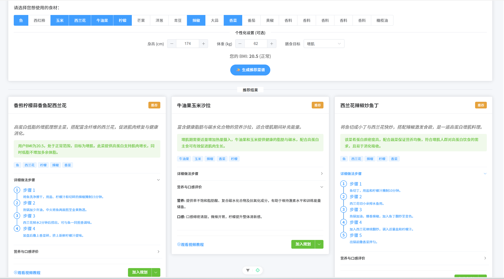
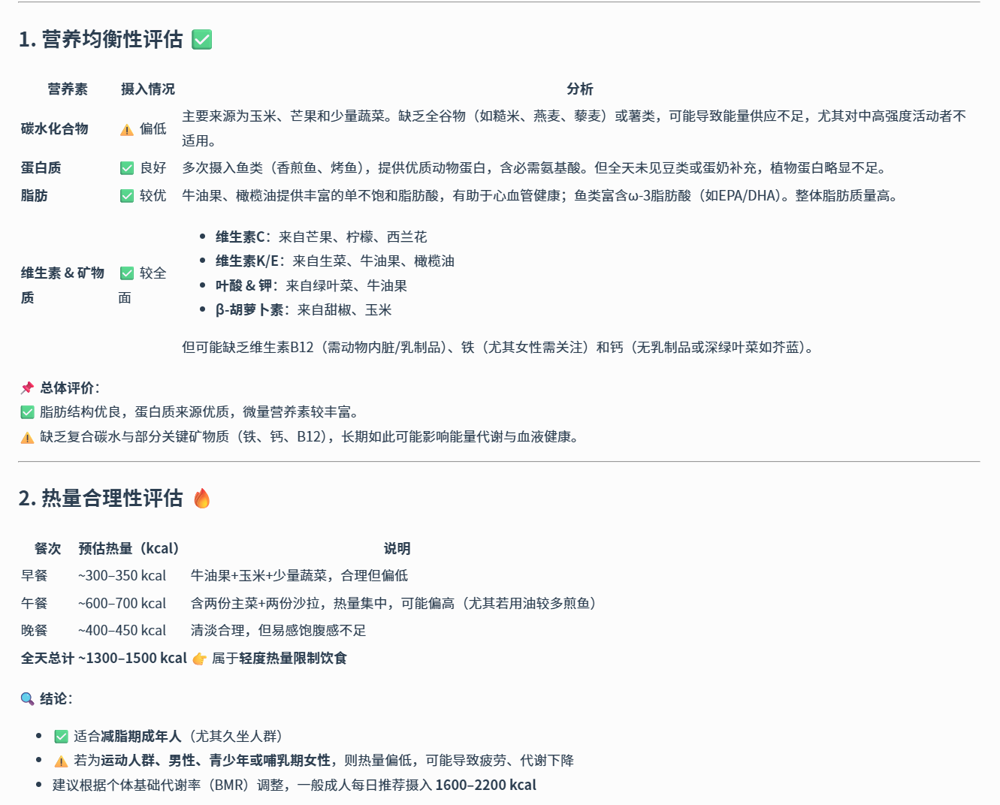
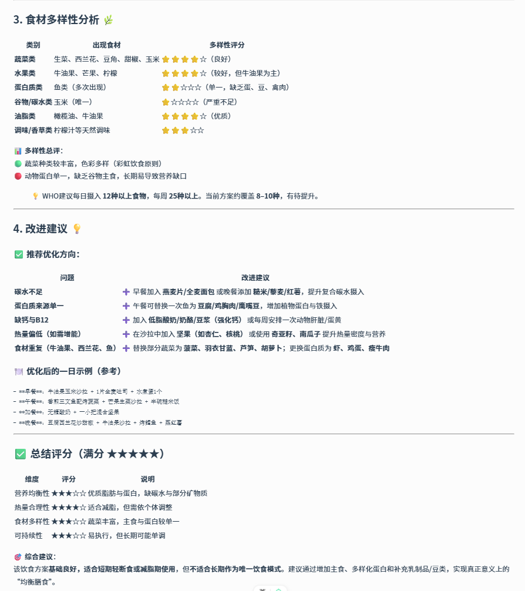

# Nutri-X 智能膳食助手 🥗

Nutri-X 是一款基于人工智能的智能膳食管理应用。它利用先进的多模态大模型（Qwen-VL）识别图片中的食材，提供精准的营养分析，并根据您的食材库存推荐美味食谱，帮助您科学规划每日膳食。

> 🚀 **技术栈**: Vue 3 + Vite + Element Plus (前端) | FastAPI (后端) | 阿里云通义千问 (AI 模型)
>
> 🌐 **在线演示**: [http://120.26.178.146:8002/](http://120.26.178.146:8002/)
>
> 📦 **Gitee 仓库**: [https://gitee.com/zjw2050/nutri-x](https://gitee.com/zjw2050/nutri-x.git)

## ✨ 应用界面

<!-- 请在此处替换为实际的应用截图 -->

### 🏠 首页：食材识别与营养分析


_上传食材图片，AI 自动识别并过滤非食物物体，展示详细营养成分。_

### 🍳 菜谱推荐


_根据识别出的食材，智能生成个性化烹饪建议。_

### 📅 三餐规划




_拖拽式三餐管理，一键生成每日营养评估报告。_

---

## 🌟 主要功能

1.  **📸 智能食材识别**:

    - 上传图片，利用 Qwen-VL-Max 模型精准识别图中食材。
    - 智能过滤餐具等非食物物体。
    - 支持重新上传和多轮识别。

2.  **📊 深度营养分析**:

    - 自动解析食材的卡路里、蛋白质、脂肪、碳水化合物含量。
    - 提供每种食材的主要健康益处说明。

3.  **👨‍🍳 个性化菜谱推荐**:

    - 基于现有食材生成详细食谱。
    - 包含制作步骤、口味评价及视频搜索关键词。

4.  **📝 智能三餐规划**:
    - 交互式添加早、中、晚餐。
    - AI 生成每日膳食评估报告，提供改进建议。

## 🛠️ 快速开始

### 1. 环境准备

- **Node.js** (v16+)
- **Python** (v3.8+)
- **阿里云 DashScope API Key** (用于调用 AI 模型)

### 2. 后端设置 (FastAPI)

```bash
# 进入项目根目录
cd Nutri-X

# 安装 Python 依赖
pip install -r requirements.txt

# 创建 .env 文件并配置 API Key (可选，也可在前端界面输入)
# echo DASHSCOPE_API_KEY=your_api_key_here > .env

# 启动后端服务
python server.py
```

_后端服务默认运行在 `http://localhost:8000`_

### 3. 前端设置 (Vue 3)

```bash
# 进入前端目录
cd FrontEnd/Nutri-X

# 安装 NPM 依赖
npm install

# 启动开发服务器
npm run dev
```

_前端页面默认运行在 `http://localhost:5173`_

## 📂 项目结构

```
Nutri-X/
├── server.py              # FastAPI 后端入口
├── utils.py               # AI 模型调用与业务逻辑工具类
├── requirements.txt       # Python 依赖
├── FrontEnd/
│   └── Nutri-X/
│       ├── src/
│       │   ├── api/       # 前后端接口定义
│       │   ├── views/     # Vue 页面 (Home, Recipes, MealPlan)
│       │   ├── store.js   # 全局状态管理
│       │   └── ...
│       ├── vite.config.js # Vite 配置
│       └── ...
└── README.md              # 项目说明文档
```

## 🤝 贡献

欢迎提交 Issue 或 Pull Request 来改进 Nutri-X！

## 📄 许可证

MIT License
